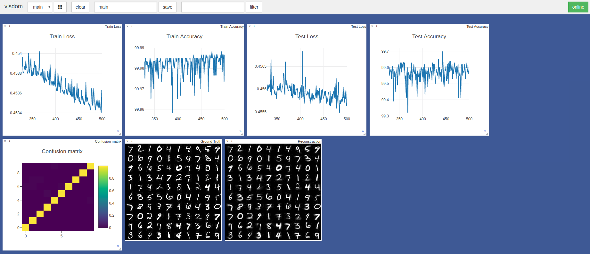

# Dynamic Routing Between Capsules

Based of a barebones CUDA-enabled PyTorch implementation of the CapsNet architecture in the paper "Dynamic Routing Between Capsules" by [Kenta Iwasaki](https://github.com/iwasaki-kenta) on behalf of Gram.AI.

##### Getting started:
1. Clone repo: 
``git clone git@github.com:hbjornoy/capsnet.git`` and enter folder ``cd capsnet``
2. Create your virtual environment, example:
``virtualenv -p /usr/bin/python3 venv``
3. Activate environment:
``source venv/bin/activate``
4. Install libraries, example uses pip3 with Python 3.6.7:
``bash install.sh``
5. open new process, preferrably with ``screen -S name``
	- activate environment
	- Run visdom, a server 
6. train model:
``python3 capsule_network.py``

##### Workflow:
If you are running on a remote server, this is a way to see the your result from visdom:
- Input the following line into you ~/.ssh/config file on your LOCAL computer, if you don't have one, create one
``LocalForward 127.0.0.1:8097 127.0.0.1:8097``

1. start up visdom as a backgroundprocess that logs to file:
``visdom 2> logs/random.log &``
2. train network
``python3 capsule_network.py`` or alternative versions

Description of libraries  used:
Training for the model is done using [TorchNet](https://github.com/pytorch/tnt), with MNIST dataset loading and preprocessing done with [TorchVision](https://github.com/pytorch/vision).

## Description

> A capsule is a group of neurons whose activity vector represents the instantiation parameters of a specific type of entity such as an object or object part. We use the length of the activity vector to represent the probability that the entity exists and its orientation to represent the instantiation paramters. Active capsules at one level make predictions, via transformation matrices, for the instantiation parameters of higher-level capsules. When multiple predictions agree, a higher level capsule becomes active. We show that a discrimininatively trained, multi-layer capsule system achieves state-of-the-art performance on MNIST and is considerably better than a convolutional net at recognizing highly overlapping digits. To achieve these results we use an iterative routing-by-agreement mechanism: A lower-level capsule prefers to send its output to higher level capsules whose activity vectors have a big scalar product with the prediction coming from the lower-level capsule.

Paper written by Sara Sabour, Nicholas Frosst, and Geoffrey E. Hinton. For more information, please check out the paper [here](https://arxiv.org/abs/1710.09829).

## Requirements

* Python 3
* PyTorch
* TorchVision
* TorchNet
* TQDM
* Visdom

## Usage

**Step 1** Adjust the number of training epochs, batch sizes, etc. inside `capsule_network.py`.

```python
BATCH_SIZE = 100
NUM_CLASSES = 10
NUM_EPOCHS = 30
NUM_ROUTING_ITERATIONS = 3
```

**Step 2** Start training. The MNIST dataset will be downloaded if you do not already have it in the same directory the script is run in. Make sure to have Visdom Server running!

```console
$ sudo python3 -m visdom.server & python3 capsule_network.py
```

## Benchmarks

Highest accuracy was 99.7% on the 443rd epoch. The model may achieve a higher accuracy as shown by the trend of the test accuracy/loss graphs below.



Default PyTorch Adam optimizer hyperparameters were used with no learning rate scheduling. 
Epochs with batch size of 100 takes ~3 minutes on a Razer Blade w/ GTX 1050 and ~2 minutes on a NVIDIA Titan XP
